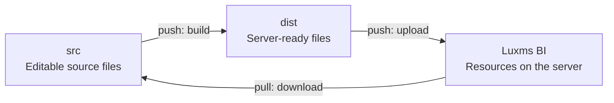

# 🔮 BI Magic Resources

[Русский](README.md) | English

Tools for developing and maintaining projects based on the **Luxms BI** platform. Create custom visualizations, style the interface, and store and edit dashlet, dashboard, and cube configurations.

Project code and resources are stored in Git with version history, making it easier to develop in parallel and coordinate the team's work. Built-in scripts let you run the project locally, validate changes, and synchronize resources with remote BI servers.

Choose a base branch that matches your BI server version:

| Branch | Luxms BI version | React version |
|---|---|---|
| `master-v11` | v11 | 18.2.0 |
| [`master`](https://github.com/luxms/bi-magic-resources/tree/master) | v12 | 19.0.0 |

## Contents

- [Quick start](#-quick-start)
- [Commands](#-commands)
- [Workflow](#-workflow)
- [Project structure](#-project-structure)
- [Configuration](#-configuration)
- [Authentication](#-authentication)

## ⚡ Quick start

### 1. Prepare your environment

You will need Git, Node.js, Yarn, and access to a BI server with permissions for the required resources. Clone the repository and install the dependencies:

```sh
git clone --branch master-v11 git@github.com:luxms/bi-magic-resources.git
cd bi-magic-resources
yarn install
```

For BI version 12, replace `--branch master-v11` with `--branch master`.

### 2. Configure the project

In `config.json`, enter your BI server address and replace `ds_my_project` with your project's schema name:

```json
{
  "server": "https://bi.example.com",
  "port": 3003,
  "include": "^ds_my_project$",
  "resources": true,
  "dashboards": false,
  "cubes": false
}
```

By default, only resources are synchronized. Enable `dashboards` to work with dashboard and dashlet configurations, or `cubes` to work with cubes. See [Configuration](#-configuration) for details on all available options.

### 3. Set up access

Create an `authConfig.json` file in the project root and enter your username and password:

```json
{
  "username": "<username>",
  "password": "<password>"
}
```

Other sign-in methods are also available. See [Authentication](#-authentication) for details.

### 4. Download resources and start the project

```sh
yarn pull --no-remove
yarn start
```

Open **http://localhost:3003**, edit files in `src`, and check the results in your browser.

## 🪄 Commands

| Command | Description |
|---|---|
| `yarn start` | Start the local development server |
| `yarn pull` | Download files from the BI server into `src` |
| `yarn build` | Build source files from `src` into `dist` |
| `yarn push` | Build the project and synchronize `dist` with the BI server |
| `yarn create-topic` | Create a topic configuration locally |
| `yarn create-dashboard` | Create a dashboard configuration locally |
| `yarn create-dashlet` | Create a dashlet configuration locally |

The configuration creation commands obtain IDs from the BI server, so they require authentication and access to the selected schema.

The diagram shows how files move through building and synchronization: from `src` through `dist` to the BI server when uploading, and directly from the BI server to `src` when downloading.



## 📋 Workflow

The steps below describe a basic workflow, from updating the project to validating changes and publishing them to the server:

1. **Update code and resources if needed.** Run `git pull --rebase` to get the latest repository state and `yarn pull` to download resources from the server.

2. **Start the environment and make changes.** Run `yarn start`, edit source files in `src`, and check the results in your browser.

   > Before editing through the interface, check the `resources`, `dashboards`, and `cubes` options in `config.json`: `dashboards` enables local editing of dashboards and dashlets, `cubes` enables local editing of cubes and dimensions, and `resources` enables the local resource list. Edit resource files in `src`. Requests without a local handler are sent to the BI server; independent local and server changes can cause overwrites during the next `yarn pull`. Restart the development server after changing the configuration.

3. **Save the history in Git.** Stage the required files (`git add`), create a commit (`git commit`), and send it to the remote repository (`git push`).

4. **Upload resources to the server.** Run `yarn push`: it first builds the project, then synchronizes the result with the server. Review the `CREATE`, `OVERWRITE`, and `REMOVE` lists before confirming.

### Synchronization and conflicts

Use these flags to control synchronization:

| Flag | Purpose |
|---|---|
| `--no-remove` | Keep files on the destination that are absent from the source: `yarn pull --no-remove` or `yarn push --no-remove` |
| `--include` and `--exclude` | Limit the schemas included in synchronization |
| `--force` | Skip confirmation for `pull` and `push` |

Before running `yarn pull`, save local changes in Git and review the `OVERWRITE` and `REMOVE` lists. The command writes server files directly into `src` without merging changes automatically. The `--no-remove` flag prevents deletion, but not overwrites. If local and server versions have changed independently, cancel synchronization and reconcile them manually before downloading again.

See [Configuration](#-configuration) for details on options, filters, and flags.

### Source formats

- Visualization build entry points are `.jsx` and `.tsx` files inside schemas in `src`; imported JavaScript and TypeScript are also processed by the build
- Styles support CSS, SCSS, and Sass; import them from visualization code
- Topic, dashboard, dashlet, and cube configurations are stored in `.json` files. JSON5 is supported when reading them; JSON data is used for server synchronization

`yarn pull` downloads server files without restoring original `.jsx` and `.tsx` files from source maps. Keep visualization source files in Git: compiled `.js` and `.map` files from the server do not replace the original project. Downloaded JSON is written without the original comments and JSON5 formatting.

## 🗂️ Project structure

Example after downloading resources and building:

```text
src/                     Editable source files stored in Git
  ds_my_project/         Resources for the selected schema
    topic.1/             Topic, dashboard, and dashlet configurations
    .cubes/              Cube and dimension configurations
dist/                    Build output for upload to the server; ignored by Git
bi-internal/             Luxms BI API type declarations
scripts/                 Build, development server, and synchronization tools
doc/                     Detailed documentation
config.json              Project settings
authConfig.json          Local sign-in credentials; ignored by Git
```

## ⚙️ Configuration

Parameters are resolved in the following order, from highest to lowest priority:

1. Command-line arguments
2. `BI_*` environment variables; `.env` in the project root only fills in missing variables
3. `config.json` for project settings and `authConfig.json` for authentication settings
4. Default values
5. Terminal prompts when a required parameter is missing

### Project settings

| Field in `config.json` | Default | Purpose |
|---|---|---|
| `server` | Prompted | BI server address |
| `port` | `3003` | Development server port |
| `include` | `^ds_\w+$` | Regular expression for including schemas |
| `exclude` | Empty string | Regular expression for excluding schemas |
| `resources` | `true` | Resources, including code, styles, and files |
| `dashboards` | `false` | Topics, dashboards, and dashlets |
| `cubes` | `false` | Cubes and dimensions |
| `noRemove` | `false` | Synchronize without deleting missing files |
| `force` | `false` | Synchronize without asking for confirmation |
| `noLogin` | `false` | Start the development server without signing in first, for work on the sign-in screen |

CLI option names use hyphens. Environment variable names use uppercase with the `BI_` prefix:

```sh
yarn start --port=8080
yarn pull --include='^ds_my_project$' --no-remove
```

Example `.env`:

```dotenv
BI_SERVER=https://bi.example.com
BI_PORT=3003
BI_INCLUDE=^ds_my_project$
BI_USERNAME=<username>
BI_PASSWORD=<password>
```

## 🔐 Authentication

The first configured authentication method is selected in the following order:

1. Browser session
2. Kerberos
3. JWT
4. Username and password

| Method | Where to configure it | Environment variables |
|---|---|---|
| Browser session | `session` in `authConfig.json` | `BI_SESSION` |
| Kerberos / SSO | `kerberos` in `config.json`, for example `HTTP@sso.example.com` | `BI_KERBEROS` |
| JWT | `jwt` in `authConfig.json` | `BI_JWT` |
| Username and password | `username`, `password` in `authConfig.json` | `BI_USERNAME`, `BI_PASSWORD` |

Permissions to read and modify the selected entities are required regardless of the sign-in method. JWT creation and the required endpoints are described in the [token guide](doc/jwt.md) (in Russian).

For multiple projects, `authConfig.json` can contain settings keyed by Git branch names:

```json
{
  "feature/my-project": {
    "username": "<username>",
    "password": "<password>"
  },
  "feature/another-project": {
    "jwt": "<token>"
  }
}
```

### Browser session via BLITZ

After signing in to BI via BLITZ, copy the value of the `LuxmsBI-User-Session` cookie and add it to your local `authConfig.json`:

```json
{
  "session": "<cookie-value>",
  "insecureSessionTls": false
}
```

Set `config.json` to the **HTTPS address of the BI server itself** and run `yarn start`. The session is validated through `/api/auth/check` and used by the proxy and the `pull`/`push` commands. In this mode, the development server listens only on `127.0.0.1`; starting it does not end the browser session.

When the session expires, update the cookie and restart the command. For a BI server with an untrusted certificate, the explicit `insecureSessionTls: true` option (`BI_INSECURE_SESSION_TLS=true`) disables certificate verification for session validation and synchronization. The default is `false`; the development proxy separately uses `secure: false`.
