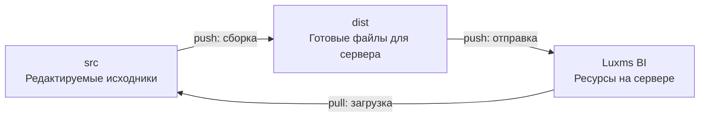

# 🔮 BI Magic Resources

Русский | [English](README.en.md)

Набор инструментов для разработки и сопровождения проектов на базе платформы **Luxms BI**. Позволяет создавать кастомные визуализации, стилизовать интерфейс, хранить и редактировать конфигурации дэшлетов, дэшбордов и кубов.

Код и ресурсы проекта хранятся в Git с историей версий, что упрощает параллельную разработку и координацию работы команды. С помощью встроенных скриптов можно запускать проект локально, проверять изменения и синхронизировать ресурсы с удалёнными BI-серверами.

Выбирайте базовую ветку в соответствии с версией вашего BI-сервера:

| Ветка | Версия Luxms BI | Версия React |
|---|---|---|
| `master-v11` | v11 | 18.2.0 |
| [`master`](https://github.com/luxms/bi-magic-resources/tree/master) | v12 | 19.0.0 |

## Содержание

- [Быстрый старт](#-быстрый-старт)
- [Команды](#-команды)
- [Рабочий процесс](#-рабочий-процесс)
- [Структура проекта](#-структура-проекта)
- [Конфигурация](#-конфигурация)
- [Авторизация](#-авторизация)

## ⚡ Быстрый старт

### 1. Подготовьте окружение

Понадобятся Git, Node.js, Yarn и доступ к BI-серверу с правами на нужные ресурсы. Склонируйте репозиторий и установите зависимости:
```sh
git clone --branch master-v11 git@github.com:luxms/bi-magic-resources.git
cd bi-magic-resources
yarn install
```
Для BI версии 12 замените `--branch master-v11` на `--branch master`.

### 2. Настройте конфиг

В `config.json` замените адрес сервера и `ds_my_project` на схему вашего проекта:
```json
{
  "server": "https://bi.example.com",
  "port": 3003,
  "include": "^ds_my_project$",
  "resources": true,
  "dashboards": false,
  "cubes": false
}
```
По умолчанию синхронизируются только ресурсы. Для работы с конфигурациями дэшбордов и дэшлетов включите `dashboards`; для кубов — `cubes`. Подробную информацию обо всех ключах смотрите в разделе [«Конфигурация»](#-конфигурация).

### 3. Настройте доступ

Создайте в корне файл `authConfig.json` и укажите логин и пароль для входа в систему:
```json
{
  "username": "<логин>",
  "password": "<пароль>"
}
```
Доступны также другие способы входа. Подробнее в разделе [«Авторизация»](#-авторизация).

### 4. Загрузите ресурсы и запустите проект
```sh
yarn pull --no-remove
yarn start
```
Откройте **http://localhost:3003**, редактируйте файлы в `src` и проверяйте результат в браузере.

## 🪄 Команды

| Команда | Описание |
|---|---|
| `yarn start` | Запустить сервер локальной разработки |
| `yarn pull` | Скачать файлы с BI-сервера в `src` |
| `yarn build` | Собрать исходники из `src` в папку `dist` |
| `yarn push` | Собрать проект и синхронизировать `dist` с BI-сервером |
| `yarn create-topic` | Создать конфигурацию темы локально |
| `yarn create-dashboard` | Создать конфигурацию дэшборда локально |
| `yarn create-dashlet` | Создать конфигурацию дэшлета локально |

Команды создания конфигураций получают идентификаторы с BI-сервера, поэтому требуют авторизации и доступа к выбранной схеме.

Схема показывает путь файлов при сборке и синхронизации: из `src` через `dist` на BI-сервер при отправке и с BI-сервера напрямую в `src` при загрузке.

## 📋 Рабочий процесс

Ниже описан базовый сценарий работы с проектом — от обновления до проверки изменений и публикации на сервере:

1. **При необходимости обновите код и ресурсы.** Выполните `git pull --rebase`, чтобы получить актуальное состояние репозитория, и `yarn pull`, чтобы загрузить ресурсы с сервера.

2. **Запустите окружение и внесите изменения.** Выполните `yarn start`, редактируйте исходники в `src` и проверяйте результат в браузере.

   > Перед правками в интерфейсе проверьте ключи `resources`, `dashboards` и `cubes` в `config.json`: `dashboards` включает локальное редактирование дэшбордов и дэшлетов, `cubes` — кубов и измерений, а `resources` — локальный список ресурсов. Файлы ресурсов редактируйте в `src`. Запросы без локального обработчика отправляются на BI-сервер; независимые правки локально и на сервере могут привести к перезаписи при следующем `yarn pull`. После изменения конфига перезапустите dev-сервер.

3. **Сохраните историю в Git.** Добавьте нужные файлы (`git add`), создайте коммит (`git commit`) и отправьте его в удалённый репозиторий (`git push`).

4. **Отправьте ресурсы на сервер.** Выполните `yarn push`: команда сначала запускает сборку, затем синхронизирует результат с сервером. Перед подтверждением проверьте список `CREATE`, `OVERWRITE`, `REMOVE`.

### Синхронизация и конфликты

Для управления синхронизацией используйте флаги:

| Флаг | Назначение |
|---|---|
| `--no-remove` | Сохраняет на целевой стороне файлы, отсутствующие в источнике: `yarn pull --no-remove` или `yarn push --no-remove` |
| `--include` и `--exclude` | Ограничивают набор схем, участвующих в синхронизации |
| `--force` | Пропускает подтверждение при `pull` и `push` |

Перед `yarn pull` сохраните локальные правки в Git и проверьте список `OVERWRITE` и `REMOVE`. Команда записывает серверные файлы прямо в `src` и не выполняет автоматическое слияние. Флаг `--no-remove` предотвращает удаление файлов, но не их перезапись. Если локальные и серверные версии изменялись независимо, отмените синхронизацию и согласуйте версии вручную перед повторной загрузкой.

Подробнее о ключах, фильтрах и флагах — в разделе [«Конфигурация»](#-конфигурация).

### Форматы исходников

- Точки входа сборки визуализаций — файлы `.jsx` и `.tsx` внутри схем в `src`; импортируемые JavaScript и TypeScript также обрабатываются сборкой
- Стили поддерживают CSS, SCSS и Sass; подключайте их из кода визуализации
- Конфиги тем, дэшбордов, дэшлетов и кубов хранятся в файлах `.json`. При чтении поддерживается JSON5, при синхронизации с сервером используются данные JSON

`yarn pull` загружает серверные файлы без восстановления исходных `.jsx` и `.tsx` из карт исходного кода. Храните исходники визуализаций в Git: готовые `.js` и `.map` с сервера не заменяют исходный проект. При загрузке JSON записывается без исходных комментариев и форматирования JSON5.

## 🗂️ Структура проекта

Пример после загрузки ресурсов и сборки:
```text
src/                     Исходники, которые редактируются и хранятся в Git
  ds_my_project/         Ресурсы выбранной схемы
    topic.1/             Конфиги темы, дэшбордов и дэшлетов
    .cubes/              Конфиги кубов и измерений
dist/                    Результат сборки для отправки на сервер; исключён из Git
bi-internal/             Объявления типов API Luxms BI
scripts/                 Сборка, dev-сервер и синхронизация
doc/                     Подробная документация
config.json              Настройки проекта
authConfig.json          Локальные данные для входа; исключены из Git
```

## ⚙️ Конфигурация

Параметры выбираются в следующем порядке, от большего приоритета к меньшему:

1. Аргументы командной строки
2. Переменные окружения `BI_*`; `.env` в корне заполняет только отсутствующие переменные
3. `config.json` для настроек проекта и `authConfig.json` для настроек авторизации
4. Значения по умолчанию
5. Ввод в терминале, если обязательный параметр не найден

### Настройки проекта

| Поле в `config.json` | По умолчанию | Назначение |
|---|---|---|
| `server` | Запрашивается | Адрес BI-сервера |
| `port` | `3003` | Порт dev-сервера |
| `include` | `^ds_\w+$` | Регулярное выражение для включения схем |
| `exclude` | Пустая строка | Регулярное выражение для исключения схем |
| `resources` | `true` | Ресурсы, включая код, стили и файлы |
| `dashboards` | `false` | Темы, дэшборды и дэшлеты |
| `cubes` | `false` | Кубы и измерения |
| `noRemove` | `false` | Синхронизация без удаления отсутствующих файлов |
| `force` | `false` | Синхронизация без запроса подтверждения |
| `noLogin` | `false` | Запуск dev-сервера без предварительного входа для разработки окна авторизации |

В CLI имена записываются через дефис, а в переменных окружения — прописными буквами с префиксом `BI_`:
```sh
yarn start --port=8080
yarn pull --include='^ds_my_project$' --no-remove
```
Пример `.env`:
```dotenv
BI_SERVER=https://bi.example.com
BI_PORT=3003
BI_INCLUDE=^ds_my_project$
BI_USERNAME=<логин>
BI_PASSWORD=<пароль>
```
## 🔐 Авторизация

Выбирается первый настроенный способ авторизации в следующем порядке:

1. Браузерная сессия
2. Kerberos
3. JWT
4. Логин и пароль

| Способ | Где задать | Переменные окружения |
|---|---|---|
| Браузерная сессия | `session` в `authConfig.json` | `BI_SESSION` |
| Kerberos / SSO | `kerberos` в `config.json`, например `HTTP@sso.example.com` | `BI_KERBEROS` |
| JWT | `jwt` в `authConfig.json` | `BI_JWT` |
| Логин и пароль | `username`, `password` в `authConfig.json` | `BI_USERNAME`, `BI_PASSWORD` |

Права на чтение и изменение выбранных сущностей нужны независимо от способа входа. Создание JWT и необходимые эндпоинты описаны в [инструкции по токенам](doc/jwt.md).

Для нескольких проектов `authConfig.json` может содержать настройки по именам Git-веток:
```json
{
  "feature/my-project": {
    "username": "<логин>",
    "password": "<пароль>"
  },
  "feature/another-project": {
    "jwt": "<токен>"
  }
}
```

### Браузерная сессия БЛИЦ

После входа в BI через БЛИЦ возьмите значение cookie `LuxmsBI-User-Session` и добавьте его в локальный `authConfig.json`:
```json
{
  "session": "<значение-cookie>",
  "insecureSessionTls": false
}
```
Укажите в `config.json` **HTTPS-адрес самого BI-сервера** и запустите `yarn start`. Сессия проверяется через `/api/auth/check`, используется прокси и командами `pull`/`push`. В этом режиме dev-сервер слушает только `127.0.0.1`; запуск не завершает браузерную сессию.

Когда сессия истечёт, обновите cookie и перезапустите команду. Для BI-сервера с недоверенным сертификатом существует явная опция `insecureSessionTls: true` (`BI_INSECURE_SESSION_TLS=true`): она отключает проверку сертификата при проверке сессии и синхронизации. Значение по умолчанию — `false`; dev-прокси отдельно использует `secure: false`.
