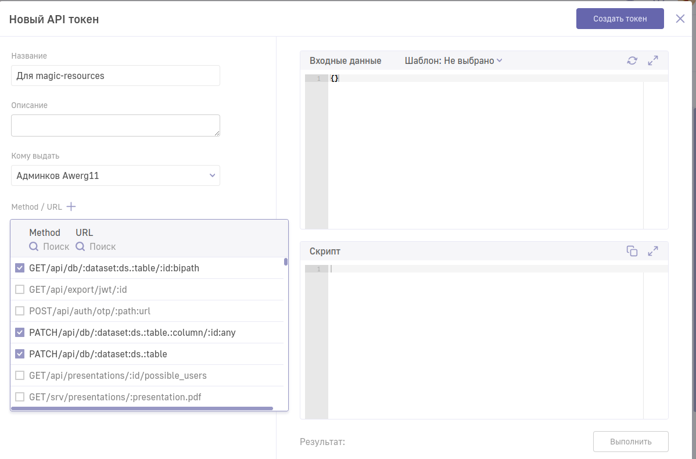

# Авторизация по JWT

## Шаг 1. Создаем токен
Зайти на страницу "API токены". Добавить новый токен. В Method/URL добавить нужные эндпоинты.



## Шаг 2. Передать токен
- Через опции командной строки
- Переменные окружения
- Файлы конфигурации

## Шаг 3. Запускаем команду
```bash
yarn start
yarn push
yarn pull
```
